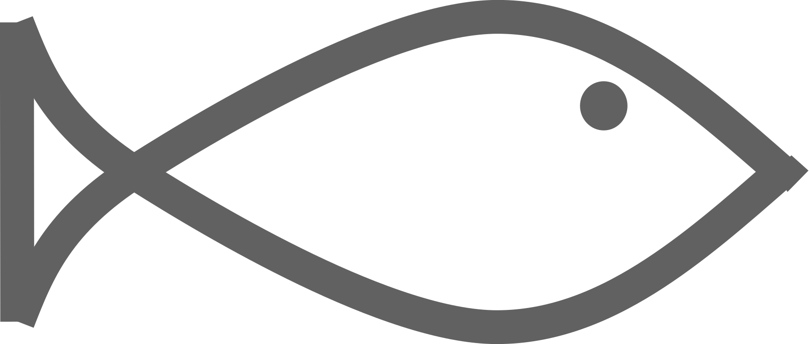

<style type="text/css">
.tekst_midden {
  vertical-align: middle;
}
</style>

```{r include=FALSE}
library(fontawesome)
```


**Gemaakt op:** `r format(Sys.time(), "%A %e %B %Y")`


# Hoofdstuk 1

- Het gaat goed {width=60} 

- Het gaat minder goed {width=80} 

- Het verbetert, en is goed {width=80}  

## Paragraaf 1

{width=50} Gewoon wat info

{width=50} Het gaat goed

{width=50}  Het gaat minder goed 


{width=50} Het gaat niet goed


# H2

check circle-check

xmark circle-xmark
plus plus-minus square-minus
minus square-minus
circle-plus circle-minus
circle-left

"fa-regular fa-circle-plus"

## par 2

<div class = tekst_midden>
`r fa("circle-check", fill = HHSKwkl::blauw, height = "2em")` En nog meer tekst

`r fa("circle-xmark", fill = HHSKwkl::oranje, height = "2em")` En meer tekst

`r fa("circle-plus", prefer_type = "regular")` En meer tekst


`r fa("square-minus")` En meer tekst

<div>